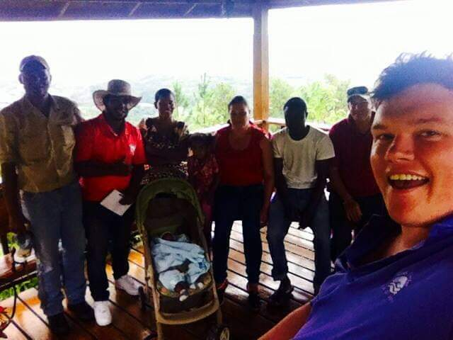
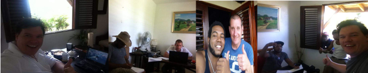
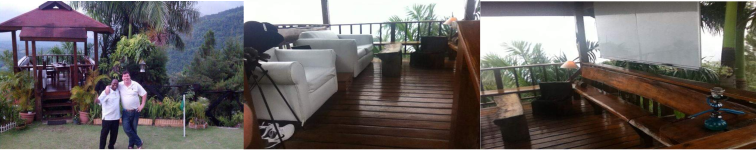
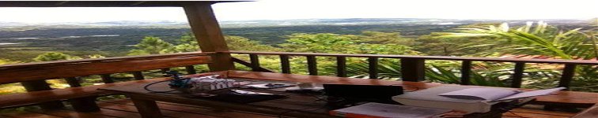

*****************************
Plan vs Performance (2014)
*****************************
  
**Associated Parties:**

+------------------------+-----------------------------------------------------------------+-------------------------------------------------+
|                        | .. centered:: Lessor & Seller                                   | .. centered:: Lessee & Buyer                    |
+========================+=================================================================+=================================================+
| .. centered:: Title    | .. centered:: **Manuel Pacheco**                                | .. centered:: **Sion H. Buckler**               |
+------------------------+-----------------------------------------------------------------+-------------------------------------------------+
| .. centered:: Office   | .. centered:: Director of Investments at Ministry of Tourism, DR| .. centered:: Founder & CEO of DATRO Consortium |
+------------------------+-----------------------------------------------------------------+-------------------------------------------------+
|                        | .. centered::                                                   | .. centered::                                   |
| .. centered::          | .. figure:: _static/pacheco_200x150.png                         | .. figure:: _static/buckler_200x150.png         |
|                        |     :width: 150px                                               |     :width: 150px                               |
|                        |     :align: center                                              |     :align: center                              |
+------------------------+-----------------------------------------------------------------+-------------------------------------------------+

Deal Plan
============

- 6 months lease in lieu of a purchase agreement:
   - **Leasehold Terms:** `6 month leasehold at $2.5k per month + 2 months security deposit` 
   - **Purchase Terms:** `5 'amortization' installments of $50k every 6 months`

.. csv-table:: Leasehold - Payment Schedule/ Rent Book (USD)
   :file: _static/plan_leasehold.csv
   :widths: 20, 40, 10, 10, 10, 10
   :header-rows: 1

.. csv-table:: Purchase Plan - Amortization (USD)
   :file: _static/plan_amortization.csv
   :widths: 20, 40, 10, 10, 10, 10
   :header-rows: 1

**Lease In Lieu of Purchase:**
~~~~~~~~~~~~~~~~~~~~~~~~~~~~~~~~
- `All lease payments (& security deposit) serve as a deductable amortization credit during the purchase agreement`
- `Duration of lease (in this case 6 months) serves as a trial run for both the buyer and seller prior to an amortization`

**Assurances:**
~~~~~~~~~~~~~~~~~

The Lessee/ Buyer assured the Lessor/ Seller using the concept of a "Soft Probe" (whereby the buyer is able to look at the holdings of the buyer to gain assurances they are in a suitable financial position to make the purchase).
DATRO's working capital for that year, was proven to be in the region of $200k+ USD -/+ 10% (almost the full purchase price of the property).

DATRO's source of capital for that year was proven to be legitimate e.g. investments and loans (albeit no trading activity/ sales revenues etc)
A breakdown of these funds and sources can be found in related documentation in the DATRO Consortium Document Library (see financials/funding).

The primary source of this 2014 fund was sale of a UK asset (45 Gregory Ave, Breaston, England, DE72 3DJ), which sold for £135,750 GBP and resulted in 74,000 GBP being invested, into what is now the DATRO Consortium.
The above info provided the Lessor/ Seller with sufficient assurances to proceed with this deal plan, terms and the aforementioned payment schedules.

Naming
#########

The DATRO Consortium will name the property **Casa Llandovery**.
The name Sion gave his former private residence, where his son Milo was born (back in Stockeld Park, Yorkshire (North England)) the previous year.
Llandovery originates from the name of the Welsh town and private boarding school where Sion studied before attending college/ the military and becoming an engineer.

Team Plan
===========

**Full-Time:**
~~~~~~~~~~~~~~~

 - Programmers (3-5) (+ onsite accomodation inc.)
 - Head of Security (+ onsite accomodation inc.)
 - Security Staff (2+)
 - Event Organiser/ Local Relations (1) 
 - Housekeeper/ Manager (1 + offsite accomodation inc.)
 - Groundkeeper (+ onsite accomodation inc.)
 - Cleaner(s) (x2)
 - Cook (2nd duty, rotation/ schedule between above personel)

   `(1) Pest Control, (2) Driver/Villa Manager (and his wife, son & daughter) (3) Cleaner, (4) Handy Man/Ground Keeper, (6) Building Works Manager, (7) Founder & CEO`

**Part-Time:**
~~~~~~~~~~~~~~~~

 - Possible security (shift, threat level increase/ decrease etc)
 - Onsite contractors (bees, fumigators, plumber, electrician etc) 
 - Programmers (visiting) e.g. DD-WRT

   `DD-WRT Executives (from Germany) with Amarni Vashi (Development Coordinator) at Casa De Campo debrief after a brief stay at the Tech House`

Performance
================

Deal Performance
~~~~~~~~~~~~~~~~~~~~~

.. csv-table:: Leasehold - Payment Performance/ Rent Book (USD)
   :file: _static/performance_leasehold.csv
   :widths: 20, 40, 10, 10, 10, 10
   :header-rows: 1

The first half of the agreement between the two parties (Lessor and Seller & Leasee and Buyer) went as expected. 

Campus Performance
~~~~~~~~~~~~~~~~~~~~

Essentials
#############

Essential Assets for basic operation: 

.. figure::  _static/otherassets_756x150.png
   :width: 620px
   :alt:  Other Assets
   :align: center

   `(1) Vehicle & (2) Whiteboard & (3) Maintained (Well-Stocked) Fridge & (4) TRAINED Security Dog`

Indoor Office
##############

Suppliers, Accounts, Staff Rosta/ Schedule (days on/off, role/duty changes etc), Daily Routines Checksheets etc

   `(1) Sion Tea & Biscuits, (2&3) Rafi & Leon, (4) Rafi, Junior, Jose & Sion`
 

Outdoor Office
#################

   `(1) Sion & Mike from Casa De Campo, (2&3) Outdoor Office "Eagles Nest"`

   `(1) View from the "Eagles Nest"`

Team Performance
~~~~~~~~~~~~~~~~~~~

The team generally worked together well to create a campus that ran like clockwork.
The main development and productivity happened in the loft, with Armani and Sion.
Outside of developing there was BBQ's in the evening, walks to the waterfall in the day.  
We also went out in the local town for food and ordered takeaways from time to time. 
Movie nights and friends and family visiting was also helpful to our wellbeing. 
Sadly there was a lot of security concerns and attacks at the time.

Staff Accomadation
###################

The Driver/ Villa Manager (Rafi) along with his wife and children were rewarded with a 3 room apartment in the local town, with underground parking. 
Rafis privelages were extended to use of a vehicle to commute home each evening and back each morning. 

.. figure::  _static/rafishouseandwife_756x150.png
   :width: 620px
   :alt:  Rafi and Wife at Apartment
   :align: center

   `(1) Rafi & Sion at Rafi's Apartment, (2&3) Apartment Photos, (4) Rafi, Rafi's Wife & Sion, Punta Cana Beach`
  
  

The Groundkeeper (Junior) occupied the groundkeepers property. 
His wife and child were permitted to be with him under special circumstances e.g. welfare, emergencies and subject to security threat levels at the campus.
Otherwise Junior would commute to see them in the local town on evening and weekends. With the cost of commuting being reflected in a weekly additional allowance. 

