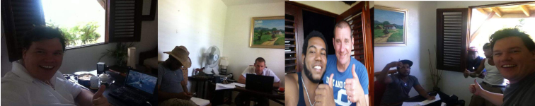

******************************************
Plan vs Performance: > Nov-2014
******************************************
  
**Associated Parties:**

+------------------------+-----------------------------------------------------------------+-------------------------------------------------+
|                        | .. centered:: Lessor & Seller                                   | .. centered:: Lessee & Buyer                    |
+========================+=================================================================+=================================================+
| .. centered:: Title    | .. centered:: **Manuel Pacheco**                                | .. centered:: **Sion H. Buckler**               |
+------------------------+-----------------------------------------------------------------+-------------------------------------------------+
| .. centered:: Office   | .. centered:: Director of Investments at Ministry of Tourism, DR| .. centered:: Founder & CEO of DATRO Consortium |
+------------------------+-----------------------------------------------------------------+-------------------------------------------------+
|                        | .. centered::                                                   | .. centered::                                   |
| .. centered::          | .. figure:: _static/pacheco_200x150.png                         | .. figure:: _static/buckler_200x150.png         |
|                        |     :width: 150px                                               |     :width: 150px                               |
|                        |     :align: center                                              |     :align: center                              |
+------------------------+-----------------------------------------------------------------+-------------------------------------------------+

Plan
============

Deal Plan
~~~~~~~~~~~

- 6 months lease in lieu of a purchase agreement:
   - **Leasehold Terms:** `6 month leasehold at $2.5k per month + 2 months security deposit` 
   - **Purchase Terms:** `5 'amortization' installments of $50k every 6 months`

.. csv-table:: Leasehold - Payment Schedule/ Rent Book (USD)
   :file: _static/plan_leasehold.csv
   :widths: 20, 40, 10, 10, 10, 10
   :header-rows: 1

.. csv-table:: Purchase Plan - Amortization (USD)
   :file: _static/plan_amortization.csv
   :widths: 20, 40, 10, 10, 10, 10
   :header-rows: 1

Lease In Lieu of Purchase
################################

- `All lease payments (& security deposit) serve as a deductable amortization credit during the purchase agreement`
- `Duration of lease (in this case 6 months) serves as a trial run for both the buyer and seller prior to an amortization`

Assurances
#################

The deal plan was assured using the concept of a "Soft Probe" (whereby the Lessor/Seller is granted access to the Lessee's/Buyer's accounts, to determine fiscal credibility).
DATRO's working capital for that year, was proven to be in the region of $200k+ USD -/+ 10%.

The legitemacy of the source of this capital was also proven e.g. investments and loans (albeit no trading activity/ sales revenues etc)
One source of a 74,000 GBP investment was for example, from the sale of a UK asset (45 Gregory Ave, Breaston, England, DE72 3DJ), which sold for £135,750 GBP in 2014.
The above info provided the Lessor/ Seller with sufficient assurances to proceed with this deal plan, terms and the aforementioned payment schedules.
DATRO's investor/ creditor public reporting can be found in the `DATRO Consortium Document Library <https://datro.xyz/static/library/>`__

Business/Technolgy Plan
~~~~~~~~~~~~~~~~~~~~~~~~~~

A copy of business plan, drafted in July 2014, can be located in our archives at `this address <https://datro.world.xyz/wayback/2014-07-24_consortium_plans-operations_business_v0.0.2.pdf>`__.
For latest releases of our public business plans, featuring notes and references of older copies, please visit `this link <https://datro.xyz/static/library/consortium_plans/operations_business/>`__ .  
 

Name Plan
~~~~~~~~~~~~~

The DATRO Consortium will name the property **Casa Llandovery**.
The name Sion gave his former private residence, where his son Milo was born (back in Stockeld Park, Yorkshire (North England)) the previous year.
Llandovery originates from the name of the Welsh town and private boarding school where Sion studied before attending college/ the military and becoming an engineer.

Campus Plans
~~~~~~~~~~~~~~~

- Develop Allotment (either side of stairs to top level)
- Driveway Stairs from Car to Front Door
- Bamboo Fencing
- Fresh Flowers Daily
- Fumegate Regularly

Team Plans
~~~~~~~~~~~~~

Below is a table laying out the team we plan to assemble for this campus:

+------------------------+-----------------------------------------------------------------+-------------------------------------------------+-------------------------------------------------+
|                        | .. centered:: **Lead Developer**                                | .. centered:: **Development CoOrdinator**       | .. centered:: **Head of Security**              | 
+========================+=================================================================+=================================================+=================================================+
|                        | .. centered::                                                   | .. centered::                                   | .. centered::                                   |
| .. centered::          | .. figure:: _static/avatar_100x75.png                           | .. figure:: _static/avatar_100x75.png           | .. figure:: _static/avatar_100x75.png           |
|                        |     :width: 100px                                               |     :width: 100px                               |     :width: 100px                               |
|                        |     :align: center                                              |     :align: center                              |     :align: center                              |
+------------------------+-----------------------------------------------------------------+-------------------------------------------------+-------------------------------------------------+

Below is a breakdwn of some plans we have for our onsite team:

Team Building Plan
###################

 - Have Friends/Families visit
 - Dinner Nights in Town
 - House Parties
 - Merrits e.g. trophies etc
 - Chunder Book (where possible make light of acts of minor negligence and incompitence)
 - Early Nock-off/ warm up drinks/bbq for the weekend
 - Command Tasks (Collective Problem Solving)

Personal Development Plan
#############################

 - Adventure Training
 - Certifications
 - Health & Fitness
 - Critical Appointments e.g. Medical, Dental etc 
 - Driving
 - Finances e.g. Credit, Investment & Saving Plans
 - Career Path/ Plan
 - Charity Work/ Volunteering 
 - Rehabilitation e.g. drugs, alcohol, smoking, gambling etc

Team Schedule Plan
###################

- Show Parades (check clothing/ haircuts etc)
- Daily Nock-on/ Nock-off Meetings (Eagles Nest)
- Secondary Duties e.g. Safety, BookKeeping, Areas of Responsibility
- Staff Lunch Area (Picnic Table at rear of property)
- Guard Night Shift, rotation, patrol routes & timings etc

Generally the support staff, under the guidance and supervision of the villa manager, upkeep the property as if it were a resort/hotel and support the developers as its guests/clients.
Generally the developers will have all their needs catered for by the support staff, allowing them maximum focus on the development of the technology venture.
The villa manager received special training and ongoing feedback during daily debriefs, to ensure developers every needs are met, while at the same time causing them minimal disruptions or distractions. 

 - The 0700 morning "nock on" meetings gives everyone a chance to openly discuss the evening and night prior as well as their needs of others for the day ahead. Goals and Objectives for the day ahead are clearly stated. 
 - The 1700 afternoon "nock off"/ de-brief meetings (in the eagles nest) allows open reflection of the days activities, communications for evenings/ weekends and preperation points for the following working day. 

Full-Time Staff
####################

.. image::  _static/armani_ddwrt_756_150.png
   :width: 620px
   :alt: `DD-WRT Executives (from Germany) with Amarni Vashi (Development Coordinator) at Casa De Campo debrief after a brief stay at the Tech House`

`DD-WRT Executives (from Germany) with Amarni Vashi (Development Coordinator) at Casa De Campo debrief after a brief stay at the Tech House`

 - Programmers (3-5) (+ onsite accomodation inc.) - @ $4,000 - 8,000 USD p/m
 - Head of Security (+ onsite accomodation inc.) - @ $6,000 USD p/m
 - Local Security Staff (2+) - @ $800 USD p/m
 - House Manager/ Driver (1 + offsite accomodation inc.) - @ $1,200 USD p/m
 - Groundkeeper (+ onsite accomodation inc.) - $600 USD p/m
 - Cook (2nd duty, rotation/ schedule between above personel) - $0 p/m 

.

`(1) Pest Control, (2) Driver/Villa Manager (and his wife, son & daughter) (3) Cleaner, (4) Handy Man/Ground Keeper, (6) Building Works Manager, (7) Founder & CEO`

Part-Time Staff
##################

 - Possible additional security (x2 - shift, threat level increase/ decrease etc) - $400 p/m
 - Onsite contractors (bees, fumigators, plumber, electrician etc) - $200 p/m
 - Programmers (visiting) e.g. DD-WRT - $35,000 USD in total
 - Local Relations/Councellor (1) - $400 USD p/m 
 - Cleaner(s) (x2) - $250 USD p/m
 - Cook (House Managers Wife) - @ $400 USD p/m

Team Remunerations
#####################

Performance
================

Deal Performance
~~~~~~~~~~~~~~~~~~~~~

.. csv-table:: Leasehold - Payment Performance/ Rent Book (USD)
   :file: _static/performance_leasehold.csv
   :widths: 20, 40, 10, 10, 10, 10
   :header-rows: 1

The first 4 of 6 months of the leashold agreement between the lessor and lessee went as planned.
See the Issues segment for details of the 5th and 6th months of the lease and the purchase plan.  

Campus Performance
~~~~~~~~~~~~~~~~~~~~

Essentials
#############

Essential Assets for basic operation: 

   `(1) Vehicle & (2) Whiteboard & (3) Maintained (Well-Stocked) Fridge & (4) TRAINED Security Dog`

Indoor Office
##############

Suppliers, Accounts, Staff Rosta/ Schedule (days on/off, role/duty changes etc), Daily Routines Checksheets etc

   `(1) Sion Tea & Biscuits, (2&3) Rafi & Leon, (4) Rafi, Junior, Jose & Sion`
 

Outdoor Office
#################

The `Eagles Nest` was ideal and multipurposes e.g. nock-on/off meetings, training, collaboration, r&r etc 
The only two modifications made included errecting a whitebard and running electrity for lighting

.. figure::  _static/outdooroffice_756x150.png
   :width: 620px
   :alt:  Eagles Nest
   :align: center

   `(1) Sion & Mike from Casa De Campo, (2&3) Outdoor Office "Eagles Nest"`

.. figure::  _static/outdooroffice2_756x150.png
   :width: 620px
   :alt:  Eagles Nest  
   :align: center

   `(1) View from the "Eagles Nest"`

Team Performance
~~~~~~~~~~~~~~~~~~~

The team generally worked together well to create a campus that ran like clockwork.
The main development and productivity happened in the loft, with Armani and Sion.
Outside of developing there was BBQ's in the evening, walks to the waterfall in the day.  
The team also went out in the local town for food and ordered takeaways from time to time. 
Movie nights and friends visiting, was also helpful to our wellbeing. 
Sadly there was a lot of security concerns and attacks at the time.

Team Building Performance
###########################

Personal Development Performance
##################################

Team Schedule Performance
#############################

   `(1) Support Staff Meeting (2) Sunday School/ Bible studies (3) Food Prep (4) Driver`

- Staff were generally on time and dilligent (with some encouragement from the villa manager)
- The expectation of cleanliness was seldom met 
- Some hiring and firing happened over the months to form a strong and happy workforce
- A dedicated cook (Rafi the Villa Managers Wife) came onboard mon-fri, allowing cooking as a 2nd duty to end
- Once a decent guard (Jose) and Cleaner was in place, they were able to bring a 2nd guard and cleaner of their choice in.

Team Remunerations
####################

.. csv-table:: Regular Labour Expenses (USD)
   :file: _static/staff_salary.csv
   :widths: 20, 20, 5, 10, 20, 25
   :header-rows: 1

Staff Accomadation
###################

The Driver/ Villa Manager (Rafi) along with his wife and children were awarded a 3 room apartment in the local town, with underground parking. 
Rafis privelages were extended to use of a vehicle to commute home each evening and back each morning. 

   `(1) Rafi & Sion at Rafi's Apartment, (2&3) Apartment Photos, (4) Rafi, Rafi's Wife & Hywel, Punta Cana Beach`
  

The Groundkeeper (Junior) occupied the groundkeepers property. 
His wife and child were permitted to be with him under special circumstances e.g. welfare, emergencies and subject to security threat levels at the campus.
Otherwise Junior would commute to see them in the local town on evening and weekends. With the cost of commuting being reflected in a weekly additional allowance. 

